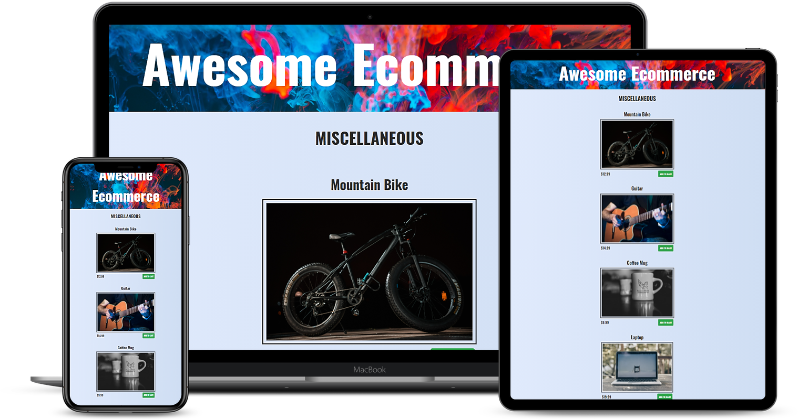

<p align="center">
   
</p>

<!-- TABLE OF CONTENTS -->
## Table of Contents

- [Built With](#built-with)
- [How to Install Locally](#how-to-install-locally)
- [License](#license)

<!-- BUILT WITH -->  

## Built With

<p align="left">
   
   
</p>  

## Screenshots

<p align="center">
  
</p>

<!-- INSTALLATION -->
## How to Install Locally

**1. Fork and clone this repository using**

```
  git clone https://github.com/sandip2224/Awesome-Ecommerce.git
  cd <Project-Folder>/
```  

**2. Install required dependencies using**

```
   npm install
```

**3. Create a .env file inside the current directory and run the server at** ``localhost:3000`` **using**

```
   node server.js
```

<!-- LICENSE -->  

## License

Distributed under the MIT License. See `LICENSE` for more information.  

## Contributing

If you'd like to contribute, please **fork** the repository and then raise a PR with necessary changes. Thank you.

## Found this project interesting?

If you found this project useful, then please consider leaving a :star: on Github
and sharing it with your friends via social media.

<!-- CONTACT -->

## Project Created & Maintained By-
  - [Sandipan Das](https://linkedin.com/in/sandipan0164/)
