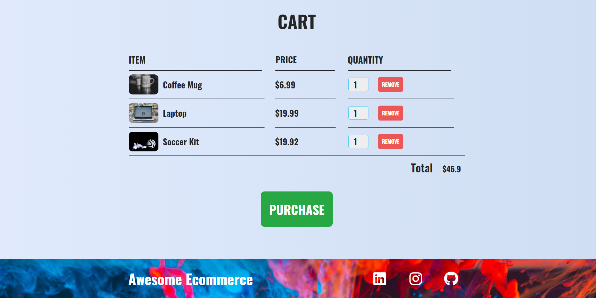
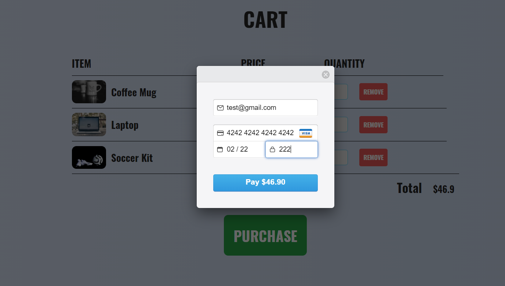
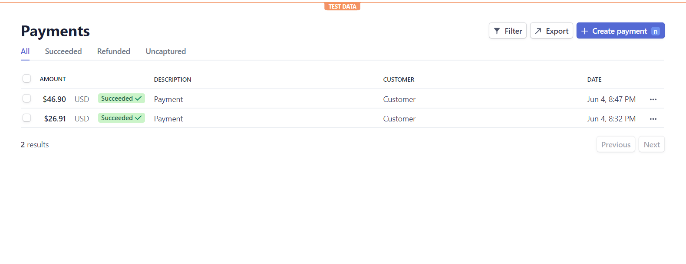
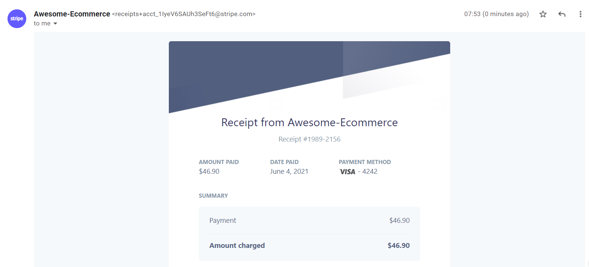

# [Awesome-Ecommerce](https://awesome-ecommerce.herokuapp.com/)⚡

<p align="center">
   
</p>

[](https://GitHub.com/Naereen/StrapDown.js/graphs/commit-activity)
[](http://shields.io/)

<!-- BUILT WITH -->  

## Built With

<p align="left">
   
   
   
   
   
   
</p>  

---

## 🔥 Screenshots

| Mockups |
| - |
|  |

| Ecommerce Cart |
| - |
|  |

| Stripe Payment Gateway |
| - |
|  |

| Stripe Dashboard Logs |
| - |
|  |

| Auto-Generated Payment Receipts  |
| - |
|  |

---

<!-- INSTALLATION -->
## How to Install Locally

**1. Fork and clone this repository using**

```
  git clone https://github.com/sandip2224/Awesome-Ecommerce.git
  cd <Project-Folder>/
```  

**2. Install required dependencies using**

```
   npm install
```

**3. Create a `.env` file inside the current directory using the following template**

```
STRIPE_PUBLIC_KEY=<Your-Public-Key>
STRIPE_SECRET_KEY=<Your-Secret-Key>
```

**4. Run the server at** ``localhost:3000`` **using**

```
   node server.js
```

---

## License

Distributed under the MIT License. See `LICENSE` for more information.  

---

## Contributing

If you'd like to contribute, please **fork** the repository and then raise a PR with necessary changes. Thank you.

---

## 🤎 Found this project interesting?

If you found this project useful, then please consider leaving a :star: on Github
and sharing it with your friends via social media.

---

## :man: Project Created & Maintained By-
  - [Sandipan Das](https://linkedin.com/in/sandipan0164/)
